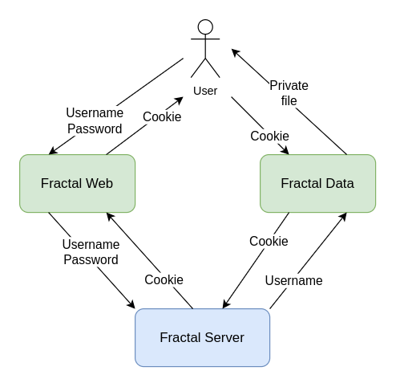

# fractal-data

Prototype to explore serving/viewing zarr data.

This repository contains a simple server application made using [Express](https://expressjs.com/).

The application has 2 endpoints:

* the root (`/`), that serves [vizarr](https://github.com/hms-dbmi/vizarr) static files;
* the endpoint `/users/{username}/{path-to-zarr}`, that serves the content of Zarr files checking user authorization.

## How it works

When a user logins to fractal-web, the browser receives a cookie that is generated by fractal-server. The same cookie is sent by the browser to other services on the same domain. The fractal-data service forwards that cookie back to fractal-server in order to obtain the username and then decides if the user is authorized to retrieve the requested file or not:



Currently the authorization check verifies if the username specified in the path matches with the username retrieved from the cookie. In the future more complex authorization mechanisms can be set up, also using an additional table in fractal-server to check allowed paths.

### Note about the domain constraint

This cookie-based technique can be used only if fractal-server and fractal-data are reachable from the same domain (or different subdomains of the same main domain). The single applications can be located on different servers, but a common reverse proxy must be used to expose them on the same domain.

If different subdomains are used for fractal-web and fractal-data, the fractal-web environment variable `AUTH_COOKIE_DOMAIN` must contain the common parent domain.

Example: if fractal-data is served on `fractal-data.mydomain.net` and fractal-web is served on `fractal-web.mydomain.net`, then `AUTH_COOKIE_DOMAIN` must be set to `mydomain.net`.

If we need to serve these services on different domains a different authentication strategy has to be chosen, for example something token-based. That results in a more complicated setup, possibly involving some extra changes on the vizarr code.

## Vizarr setup

In order to display a proper error message related to the missing authorization it is necessary to use a modified version of vizarr.

Clone the [vizarr repo](https://github.com/hms-dbmi/vizarr), checkout to `ca1b1c5693f3cdc355a1e2f2f6b7bb57ba62d4ed` (that is the current reference to the main branch while writing this README) and apply the vizarr.patch contained in this repository.

Run `npm install` to install the dependencies.

Then it is also necessary to modify the [zarr.js](https://github.com/gzuidhof/zarr.js) library used by vizarr, adding the propagation of HTTP errors. Notice that there is an [open pull request](https://github.com/gzuidhof/zarr.js/pull/151) about this.

Open the file `node_modules/zarr/core.mjs` and add the following at the line 3187 (in function `containsItem()` of `HTTPStore` class):

```javascript
if (value.status !== 200 && value.status !== 404) {
  throw new HTTPError(String(value.status));
}
```

Run `npm run build`. This will generate the static files inside the `out` folder. These files will be served by the app contained in this repo.

## Fractal-data setup

Copy the file `.env.example` to `.env` and define proper values for the environment variables.

```bash
npm install
```

Then run `npm run start` to start the project. The server will start on port 3000.

Login on fractal-web and then on another tab open the following URL to display the example dataset:

http://localhost:3000/?source=http://localhost:3000/users/admin/20200812-CardiomyocyteDifferentiation14-Cycle1.zarr/B/03/0
