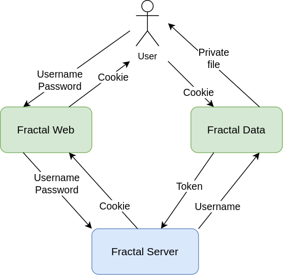

# fractal-vizarr-viewer

Prototype to explore serving/viewing zarr data.

This repository contains a simple server application made using [Express](https://expressjs.com/).

The application has 2 endpoints:

* the root (`/`), that serves [vizarr](https://github.com/hms-dbmi/vizarr) static files;
* the endpoint `/data/{path-to-zarr}`, that serves the content of Zarr files checking user authorization.

> To run fractal-vizarr-viewer you need to have an active instance of `fractal-server` and an active instance of `fractal-web`. You need to log-in to `fractal-web` from the browser using a user that has been authorized to see the vizarr files. Details about authorization are explained in the next section.

## How it works

When a user logins to fractal-web, the browser receives a cookie that is generated by fractal-server. The same cookie is sent by the browser to other services on the same domain. The fractal-vizarr-viewer service extracts the token contained in the cookie and forwards it back to fractal-server in order to obtain the allowed viewer paths for the user and then decides if the user is authorized to retrieve the requested file or not:



Currently we support 3 different kinds of authorization checks, that can be specified using the `AUTHORIZATION_SCHEME` environment variable. The service retrieves the user details from the cookie calling fractal server and then applies the configured authorization logic. See the [environment variables](#environment-variables) section below for details about the supported authorization schemes.

### Accessing files using the token

While in the browser the authentication relies on cookies, that are automatically shared by the browser across fractal services, for command line and desktop applications it is more appropriate to use bearer tokens. For this reason, files exposed by fractal-vizarr-viewer can be retrieved both using cookies and tokens. The token can be downloaded from fractal-web user profile page. The following example shows an example of usage with `curl`:

```sh
curl -H "Authorization: Bearer $(cat /path/to/fractal-token.txt)" http://localhost:3000/vizarr/data/path/to/file
```

### Note about the domain constraint

This cookie-based technique can be used only if fractal-server and fractal-vizarr-viewer are reachable from the same domain (or different subdomains of the same main domain). The single applications can be located on different servers, but a common reverse proxy must be used to expose them on the same domain.

If different subdomains are used for fractal-web and fractal-vizarr-viewer, the fractal-web environment variable `AUTH_COOKIE_DOMAIN` must contain the common parent domain.

Example: if fractal-vizarr-viewer is served on `fractal-vizarr-viewer.mydomain.net` and fractal-web is served on `fractal-web.mydomain.net`, then `AUTH_COOKIE_DOMAIN` must be set to `mydomain.net`.

If we need to serve these services on different domains a different authentication strategy has to be chosen, for example something token-based. That results in a more complicated setup, possibly involving some extra changes on the vizarr code.

## Install fractal-vizarr-viewer from release packages

The application is composed by a Node.js server and the Vizarr static files. Starting from version 0.1.3, fractal-vizar-viewer releases provide tar.gz files containing built Vizarr static files and a package of built files for each supported node version.

Create one folder for the server and one folder for Vizarr static files and then run the following commands.

Enter the Vizarr directory and unpack Vizarr static files:

```
FRACTAL_VIZARR_VIEWER_VERSION=0.1.3a0 && wget -qO- "https://github.com/fractal-analytics-platform/fractal-vizarr-viewer/releases/download/v${FRACTAL_VIZARR_VIEWER_VERSION}/fractal-vizarr-v${FRACTAL_VIZARR_VIEWER_VERSION}.tar.gz" | tar -xz
```

**Note**: this will unpack in the current working directory the vizarr `dist` folder.

Enter the server directory and unpack fractal-vizarr-viewer server files:

```
FRACTAL_VIZARR_VIEWER_VERSION=0.1.3a0 && NODE_MAJOR_VERSION=20 && wget -qO- "https://github.com/fractal-analytics-platform/fractal-vizarr-viewer/releases/download/v${FRACTAL_VIZARR_VIEWER_VERSION}/node-${NODE_MAJOR_VERSION}-fractal-vizarr-viewer-v${FRACTAL_VIZARR_VIEWER_VERSION}.tar.gz " | tar -xz
```

**Note**: this will unpack in the current working directory the file `package.json` and the folders `dist` and `node_modules`.

To start the application installed in this way see the section [Run fractal-vizarr-viewer from the build folder](#run-fractal-vizarr-viewer-from-the-build-folder) below.

## Environment variables

* `PORT`: the port where fractal-vizarr-viewer app is served;
* `FRACTAL_SERVER_URL`: the base URL of fractal-server;
* `VIZARR_STATIC_FILES_PATH`: path to the files generated running `npm run build` in vizarr source folder;
* `BASE_PATH`: base path of fractal-vizarr-viewer application;
* `AUTHORIZATION_SCHEME`: defines how the service verifies user authorization. The following options are available:
  * `fractal-server`: the paths that can be accessed by each user are retrieved calling fractal-server API.
  * `testing-basic-auth`: enables Basic Authentication for testing purposes. The credentials are specified through two additional environment variables: `TESTING_USERNAME` and `TESTING_PASSWORD`. This option should not be used in production environments.
  * `none`: no authorization checks are performed, allowing access to all users, including anonymous ones. This option is useful for demonstrations and testing but should not be used in production environments.
* `CACHE_EXPIRATION_TIME`: cookie cache TTL in seconds; when user info is retrieved from a cookie calling the current user endpoint on fractal-server the information is cached for the specified amount of seconds, to reduce the number of calls to fractal-server;
* `LOG_LEVEL_CONSOLE`: the log level of logs that will be written to the console; the default value is `info`;
* `LOG_FILE`: the path of the file where logs will be written; by default is unset and no file will be created;
* `LOG_LEVEL_FILE`: the log level of logs that will be written to the file; the default value is `info`;

## Run fractal-vizarr-viewer from the build folder

You can create a script with the following content to run fractal-vizarr-viewer installed from a release package:

```bash
#!/bin/sh

export PORT=3000
export FRACTAL_SERVER_URL=http://localhost:8000
export VIZARR_STATIC_FILES_PATH=/path/to/vizarr/dist
export AUTHORIZATION_SCHEME=fractal-server
# default values for logging levels (uncomment if needed)
# export LOG_LEVEL_CONSOLE=info
# export LOG_FILE=/path/to/log
# export LOG_LEVEL_FILE=info

# default values are usually fine for the following variables; remove comments if needed
# export BASE_PATH=/vizarr
# export CACHE_EXPIRATION_TIME=60

node dist/app.js
```

**Note**: starting from Node 20 you can also load the environment variables from a file using the `--env-file` flag:

```bash
node --env-file=.env dist/app.js
```

## Create some test data

Create a folder (i.e. `zarr-files`) that will contain the zarr files served by fractal-vizarr-viewer. This folder has to be added to the allowed viewer paths exposed by fractal-server API, for example setting it as the `project_dir` for a given user.

You can fill the folder with some test data using the following command:

```bash
mkdir zarr-files
cd zarr-files
wget https://zenodo.org/records/10424292/files/20200812-CardiomyocyteDifferentiation14-Cycle1_mip.zarr.zip?download=1
unzip 20200812-CardiomyocyteDifferentiation14-Cycle1_mip.zarr.zip?download=1
```

## See the test data

Login on fractal-web and then on another tab open the following URL to display the example dataset:

http://localhost:3000/vizarr?source=http://localhost:3000/vizarr/data/path/to/20200812-CardiomyocyteDifferentiation14-Cycle1_mip.zarr/B/03/0

## Production setup

Add an Apache configuration to expose fractal-vizarr-viewer service on a given path of the public server. The specified location must have the same value set in fractal-vizarr-viewer `BASE_PATH` environment variable (the default value is `/vizarr`).

```
<Location /vizarr>
    ProxyPass http://127.0.0.1:3000/vizarr
    ProxyPassReverse http://127.0.0.1:3000/vizarr
</Location>
```

Add a systemd unit file in `/etc/systemd/system/fractal-vizarr-viewer.service`:

```
[Unit]
Description=Fractal Vizarr Viewer service
After=syslog.target

[Service]
User=fractal
Environment="PORT=3000"
Environment="FRACTAL_SERVER_URL=https://fractal-server.example.com/"
Environment="VIZARR_STATIC_FILES_PATH=/path/to/vizarr/dist"
Environment="BASE_PATH=/vizarr"
Environment="AUTHORIZATION_SCHEME=fractal-server"
Environment="CACHE_EXPIRATION_TIME=60"
Environment="LOG_FILE=/path/to/log"
Environment="LOG_LEVEL_FILE=info"
ExecStart=/path/to/node /path/to/fractal-vizarr-viewer/dist/app.js
Restart=on-failure
RestartSec=5s

[Install]
WantedBy=multi-user.target
```

Enable the service and start it:

```sh
sudo systemctl enable fractal-vizarr-viewer
sudo systemctl start fractal-vizarr-viewer
```

## Build fractal-vizarr-viewer manually

### Fractal-vizarr-viewer setup

Get and install the `fractal-vizarr-viewer` application:

```bash
git clone https://github.com/fractal-analytics-platform/fractal-vizarr-viewer.git
cd fractal-vizarr-viewer
npm install
```

Copy the file `.env.example` to `.env` and customize values for the environment variables.

### Vizarr setup

In order to display a proper error message related to the missing authorization it is necessary to use a modified version of vizarr.

> Vizarr needs to be built using **pnpm**. To install it you can use `npm install -g pnpm`.

> Note: for simplicity, we assume that `fractal-vizarr-viewer` and `vizarr` are subfolders of the same folder:

```bash
git clone https://github.com/hms-dbmi/vizarr.git
cd vizarr
git checkout d70b0c9ab86acfcd79fd4bbb61f076bd122cb3cc
pnpm install
pnpm run build
```

The output is located in the `dist` folder.

### Run fractal-vizarr-viewer

Then go back to fractal-vizarr-viewer folder and run `npm run start` to start the project. The server will start on port 3000.

## Docker setup

The following script can be used to build and start a docker image for testing:

```sh
#!/bin/sh

COMMIT_HASH=$(git rev-parse HEAD)
IMAGE_NAME="fractal-vizarr-viewer-$COMMIT_HASH"

docker build . -t "$IMAGE_NAME"

docker run --network host \
  -v /tmp/zarr-files:/zarr-files \
  -e FRACTAL_SERVER_URL=http://localhost:8000 \
  -e AUTHORIZATION_SCHEME=fractal-server \
  "$IMAGE_NAME"
```

For production replace the `--network host` option with a proper published port `-p 3000:3000` and set `FRACTAL_SERVER_URL` as an URL using a public domain.
