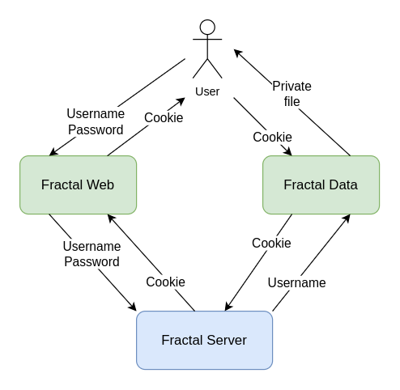

# fractal-data

This is the repository that contains the **Fractal data** streaming service. Find more information about Fractal in general and the other repositories at the [Fractal home page](https://fractal-analytics-platform.github.io).

This repository contains a simple server application made using [Express](https://expressjs.com/).

The application has 3 endpoints:

- the endpoint `/files/{path-to-zarr}`, that serves the content of Zarr files checking user authorization.
- the endpoint `/alive`, that returns the status of the service.
- the optional endpoint `/vizarr`, that serves vizarr static files when the `VIZARR_STATIC_FILES_PATH` environment variable is set.

> NOTE: To run `fractal-data` you need to have active instances of `fractal-server` and `fractal-web`, and you need to log-in to `fractal-web` from the browser. Details about authorization are explained in the next section.

## How it works

When a user logins to `fractal-web`, the browser receives a cookie that is generated by `fractal-server`. The same cookie is sent by the browser to other services on the same domain. The `fractal-data` service extracts the token contained in the cookie and forwards it back to `fractal-server` in order to obtain the allowed viewer paths for the user and then decides if the user is authorized to retrieve the requested file or not:



Currently we support a single `AUTHORIZATION_SCHEME=fractal-server` authorization checks. The `fractal-data` service retrieves the user details from the cookie by calling `fractal-server` and then applies the configured authorization logic.

### Accessing files using the token

While in the browser the authentication relies on cookies, that are automatically shared by the browser across Fractal services, for command line and desktop applications it is more appropriate to use bearer tokens. For this reason, files exposed by `fractal-data` can be retrieved both using cookies and tokens. The token can be downloaded from `fractal-web` user profile page. The following example shows an example of usage with `curl`:

```sh
curl -H "Authorization: Bearer $(cat /path/to/fractal-token.txt)" http://localhost:3000/files/path/to/file
```

### Note about the domain constraint

This cookie-based technique can be used only if `fractal-server` and `fractal-data` are reachable from the same domain (or different subdomains of the same main domain). The single applications can be located on different servers, but a common reverse proxy must be used to expose them on the same domain.

If different subdomains are used for `fractal-web` and `fractal-data`, the `fractal-web` environment variable `AUTH_COOKIE_DOMAIN` must contain the common parent domain.

Example: if `fractal-data` is served on `fractal-data.mydomain.net` and `fractal-web` is served on `fractal-web.mydomain.net`, then `AUTH_COOKIE_DOMAIN` must be set to `mydomain.net`.

## Install fractal-data from release packages

> This is the suggested way to install fractal-data.

The release packages include the Node.js server and tar.gz files containing a package of built files for each supported node version.

### Install Vizarr static files

Vizarr static files can be served using any server, like Apache or Ngnix.

Fetch and extract the Vizarr static files as in

```
export VIZARR_VERSION="1.2.1"
wget "https://github.com/BioNGFF/vizarr/releases/download/v${VIZARR_VERSION}/dist.tar.gz"
tar -xvf dist.tar.gz
```

which then makes them available in `sites/app/dist/`.

Then you may e.g. copy the folder contents into `/var/www/html/vizarr` (for Apache), or serve Vizarr via `fractal-data` by setting the `VIZARR_STATIC_FILES_PATH` variable.

### Install fractal-data Node.js server files

Create a folder for the server files, navigate into it, and extract the fractal-data server files:

```
FRACTAL_DATA_VERSION=0.1.3a0 && NODE_MAJOR_VERSION=24 && wget -qO- "https://github.com/fractal-analytics-platform/fractal-data/releases/download/v${FRACTAL_DATA_VERSION}/node-${NODE_MAJOR_VERSION}-fractal-data-v${FRACTAL_DATA_VERSION}.tar.gz " | tar -xz
```

**Note**: this will unpack in the current working directory the file `package.json` and the folders `dist` and `node_modules`.

To start the application installed in this way see the section [Run fractal-data from the build folder](#run-fractal-data-from-the-build-folder) below.

## Environment variables

- `PORT`: the port where fractal-data app is served;
- `BIND_ADDRESS`: specifies the IP address for the server to bind to; use `0.0.0.0` (IPv4) or `::` (IPv6) to listen on all interfaces, `127.0.0.1` (IPv4) or `::1` (IPv6) for localhost only; the default value is `0.0.0.0`;
- `FRACTAL_SERVER_URL`: the base URL of fractal-server;
- `VIZARR_STATIC_FILES_PATH`: path to the files generated running `npm run build` in Vizarr source folder; this variable is optional and, if present, it will be used to serve Vizarr static files from the `/vizarr` endpoint;
- `BASE_PATH`: base path of fractal-data application;
- `AUTHORIZATION_SCHEME`: defines how the service verifies user authorization. The following options are available:
  - `fractal-server`: the paths that can be accessed by each user are retrieved calling fractal-server API.
- `CACHE_EXPIRATION_TIME`: cookie cache TTL in seconds; when user info is retrieved from a cookie calling the current user endpoint on fractal-server the information is cached for the specified amount of seconds, to reduce the number of calls to fractal-server;
- `LOG_LEVEL_CONSOLE`: the log level of logs that will be written to the console; the default value is `info`;
- `LOG_FILE`: the path of the file where logs will be written; by default is unset and no file will be created;
- `LOG_LEVEL_FILE`: the log level of logs that will be written to the file; the default value is `info`;
- `LOG_CONFIG_FILE`: the path of a custom log4js configuration file; if this variable is set, the configuration specified in the file will be used instead of the default one, and `LOG_LEVEL_CONSOLE`, `LOG_FILE` and `LOG_LEVEL_FILE` will be ignored.

## Run fractal-data from the build folder

You can create a script with the following content to run fractal-data installed from a release package:

```bash
#!/bin/sh

export PORT=3000
export BIND_ADDRESS=0.0.0.0
export FRACTAL_SERVER_URL=http://localhost:8000
export AUTHORIZATION_SCHEME=fractal-server
# default values for logging levels (uncomment if needed)
# export LOG_LEVEL_CONSOLE=info
# export LOG_FILE=/path/to/log
# export LOG_LEVEL_FILE=info

# default values are usually fine for the following variables; remove comments if needed
# export BASE_PATH=/data
# export CACHE_EXPIRATION_TIME=60

node dist/app.js
```

**Note**: starting from Node 20 you can also load the environment variables from a file using the `--env-file` flag:

```bash
node --env-file=.env dist/app.js
```

## Create some test data

Create a folder (i.e. `zarr-files`) that will contain the zarr files served by `fractal-data`. This folder has to be added to the allowed viewer paths exposed by `fractal-server` API, for example setting it as the `project_dir` for a given user.

You can fill the folder with some test data using the following command:

```bash
mkdir zarr-files
cd zarr-files
wget https://zenodo.org/records/10424292/files/20200812-CardiomyocyteDifferentiation14-Cycle1_mip.zarr.zip?download=1
unzip 20200812-CardiomyocyteDifferentiation14-Cycle1_mip.zarr.zip?download=1
```

## See the test data

Login on `fractal-web` and then on another tab open the following URL to display the example dataset:

http://localhost:3000/data?source=http://localhost:3000/data/files/path/to/20200812-CardiomyocyteDifferentiation14-Cycle1_mip.zarr/B/03/0

## Production setup

Add an Apache configuration to expose `fractal-data` service on a given path of the public server. The specified location must have the same value set in `fractal-data` `BASE_PATH` environment variable (the default value is `/data`).

```
<Location /data>
    ProxyPass http://127.0.0.1:3000/data
    ProxyPassReverse http://127.0.0.1:3000/data
</Location>
```

Add a systemd unit file in `/etc/systemd/system/fractal-data.service`:

```
[Unit]
Description=Fractal Data service
After=syslog.target

[Service]
User=fractal
Environment="PORT=3000"
Environment="BIND_ADDRESS=0.0.0.0"
Environment="FRACTAL_SERVER_URL=https://fractal-server.example.com/"
Environment="BASE_PATH=/data"
Environment="AUTHORIZATION_SCHEME=fractal-server"
Environment="CACHE_EXPIRATION_TIME=60"
Environment="LOG_FILE=/path/to/log"
Environment="LOG_LEVEL_FILE=info"
ExecStart=/path/to/node /path/to/fractal-data/dist/app.js
Restart=on-failure
RestartSec=5s

[Install]
WantedBy=multi-user.target
```

Enable the service and start it:

```sh
sudo systemctl enable fractal-data
sudo systemctl start fractal-data
```

## Build fractal-data manually

### Fractal-data-viewer setup

Get and install the `fractal-data` application:

```bash
git clone https://github.com/fractal-analytics-platform/fractal-data.git
cd fractal-data
npm install
# If your data is stored on S3, install also the AWS dependencies
npm run install:aws
```

Copy the file `.env.example` to `.env` and customize values for the environment variables.

### Run fractal-data

Then go back to `fractal-data` folder and run `npm run start` to start the project. The server will start on port 3000. Remember to set the `VIZARR_STATIC_FILES_PATH`, to serve Vizarr static files from the `/vizarr` endpoint - if needed. Vizarr static files need to be served from the same port and domain of the `fractal-data` service, otherwise you will encounter CORS issues.

### Alive endpoint

It is possible to use the `/alive` endpoint to check if the service is up and running and retrieve its version.

## Docker setup

The following script can be used to build and start a docker image for testing:

```sh
#!/bin/sh

COMMIT_HASH=$(git rev-parse HEAD)
IMAGE_NAME="fractal-data-$COMMIT_HASH"

docker build . -t "$IMAGE_NAME"

docker run --network host \
  -v /tmp/zarr-files:/zarr-files \
  -e FRACTAL_SERVER_URL=http://localhost:8000 \
  -e AUTHORIZATION_SCHEME=fractal-server \
  "$IMAGE_NAME"
```

For production replace the `--network host` option with a proper published port `-p 3000:3000` and set `FRACTAL_SERVER_URL` as an URL using a public domain.

## Contributors and license

The Fractal project is developed by the [BioVisionCenter](https://www.biovisioncenter.uzh.ch/en.html) at the University of Zurich, who contracts [eXact lab s.r.l.](https://www.exact-lab.it/en/) for software engineering and development support.

Unless otherwise specified, Fractal components are released under the BSD 3-Clause License, and copyright is with the BioVisionCenter at the University of Zurich.
